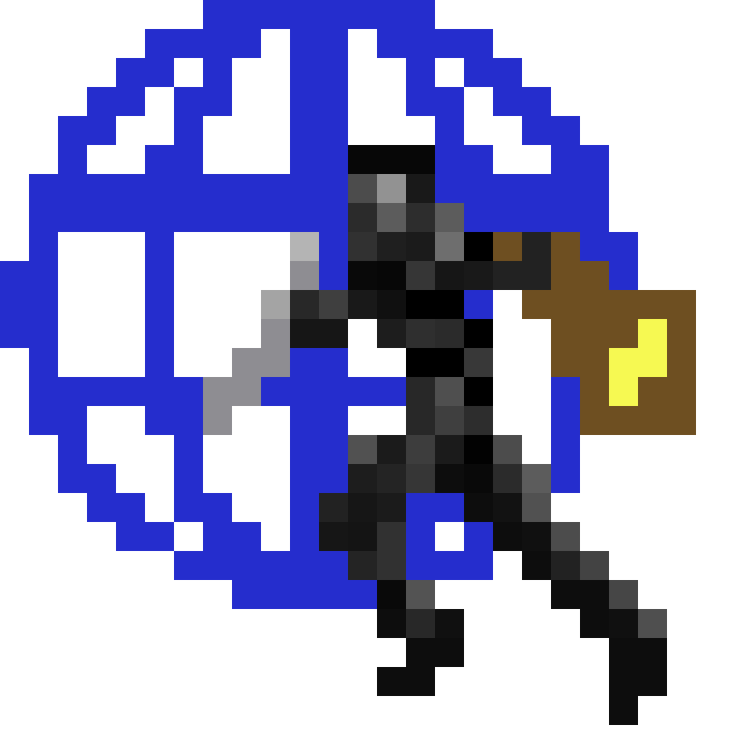

# WebRogue



WebRogue is a small statically checked language for scripting browser roguelike games. It lets a game author describe dungeon objects and Ren'Py-inspired states beside ordinary turn logic, then compiles that script to readable JavaScript. The language is intentionally compact: enough static structure to be interesting for a compiler course, but not so large that the compiler hides the important ideas.

## Why WebRogue Exists

Browser games often start as loose JavaScript objects and event handlers. WebRogue asks what that workflow might look like if the game script had a compiler watching for common mistakes first: misspelled object names, bad health types, broken return values, invalid state contents, and jumps to unknown states. The result is a toy language with a real compile-time safety story.

## Features

- Primitive types: `number`, `string`, `boolean`, and `void`
- `let` declarations with optional type inference from initializers
- Assignment, `print`, `if` / `else`, `while`, `break`, and `return`
- Functions with typed parameters and typed return types
- Function calls and expression statements
- `object` declarations for game objects
- `state` declarations with `title`, `description`, and `contains`
- `_jump(StateName);` state transitions, inspired by Ren'Py page/label jumps
- Arithmetic, comparison, equality, boolean, and unary expressions
- Line comments beginning with `//`
- JavaScript generation for runnable scripts and plain JS game objects

## Static Checks

The analyzer performs these checks before optimization or code generation:

- Identifiers must be declared before use.
- Duplicate declarations are rejected in the same lexical scope.
- Variables cannot have type `void`.
- Initializers and assignments must match the declared or inferred variable type.
- `if` and `while` tests must be boolean.
- `break` can appear only inside a loop.
- `return` can appear only inside a function.
- Return values must match the function return type.
- Non-void functions must return a value on every straightforward static path.
- Function calls must use the correct number and types of arguments.
- Calls to non-functions are rejected.
- Object and state names must be unique in the active scope.
- Object fields must be unique and their initializers must match field types.
- States must include `title`, `description`, and `contains`.
- State `contains` entries must reference declared objects and cannot repeat an object.
- `_jump` targets must be declared states. Forward jumps to later state declarations are allowed.

## State Model

States are lightweight pages for game flow. A program's current state defaults to `Start` when a `state Start` declaration exists. If there is no `Start`, the first declared state becomes the initial state so small examples can still run.

WebRogue source uses identifier-style state jumps:

```wr
_jump(Entry);
```

Generated JavaScript tracks the current state by name:

```js
let __webrogueCurrentState = "Start";
function _jump(targetState) {
  __webrogueCurrentState = targetState;
  return __webrogueCurrentState;
}

_jump("Entry");
```

## Not Implemented

WebRogue is not a game engine. It does not implement general arrays, field access, object literals, imports, browser DOM helpers, sprites, maps, or runtime movement APIs. The only list syntax is the checked `contains: [ObjectName, ...]` state field. Function and object declarations are checked in declaration order, so ordinary calls and object references must refer to earlier declarations. `_jump` is the exception: it may target a state declared later in the program.

The return-path checker is intentionally modest. It handles direct `return` statements and `if` / `else` statements whose branches both return. It does not try to prove that a `while true` loop always returns.

## Examples

### Tiny Dungeon

```wr
object Player {
  name: string = "Mira";
  hp: number = 12;
  alive: boolean = true;
}

object Slime {
  name: string = "Slime";
  hp: number = 4;
  alive: boolean = true;
}

state Start {
  title: "Dungeon Start";
  description: "A half-burned torch marks the safe edge of the dungeon.";
  contains: [Player];
}

state Entry {
  title: "Mossy Entry";
  description: "Cold stairs descend into the first pocket of dungeon air.";
  contains: [Player, Slime];
}

function damage(hp: number, amount: number) -> number {
  return hp - amount;
}

let playerHp: number = 12;
if playerHp > 0 {
  print "ready";
} else {
  print "fallen";
}

while playerHp > 9 {
  playerHp = damage(playerHp, 1);
  if playerHp == 10 {
    break;
  }
}

_jump(Entry);
print playerHp;
```

### Generated JavaScript

```js
let __webrogueCurrentState = "Start";
function _jump(targetState) {
  __webrogueCurrentState = targetState;
  return __webrogueCurrentState;
}

const Player = {
  name: "Mira",
  hp: 12,
  alive: true,
};

const Slime = {
  name: "Slime",
  hp: 4,
  alive: true,
};

const Start = {
  title: "Dungeon Start",
  description: "A half-burned torch marks the safe edge of the dungeon.",
  contains: [Player],
};

const Entry = {
  title: "Mossy Entry",
  description: "Cold stairs descend into the first pocket of dungeon air.",
  contains: [Player, Slime],
};

function damage(hp, amount) {
  return (hp - amount);
}
```

More complete examples live in `examples/`:

- `examples/hello.wr`
- `examples/combat.wr`
- `examples/states.wr`
- `examples/loop.wr`
- `examples/functions.wr`
- `examples/tiny-dungeon.wr`
- `examples/errors/bad-type.wr` is intentionally invalid and should fail analysis.

## Install And Test

Use Node.js 20 or newer.

```sh
npm install
npm test
```

`npm test` runs the Node test runner through `c8`, so the test output includes coverage reporting.

## Run The Compiler

```sh
node src/webrogue.js <filename> <outputType>
```

`outputType` may be omitted. The default is `js`.

```sh
node src/webrogue.js examples/hello.wr parsed
node src/webrogue.js examples/combat.wr analyzed
node src/webrogue.js examples/loop.wr optimized
node src/webrogue.js examples/states.wr js
```

You can also use the npm script:

```sh
npm run compile -- examples/tiny-dungeon.wr js
```

## Compiler Pipeline

- `parsed`: parses source with the Ohm grammar and prints the AST-like representation.
- `analyzed`: resolves names, checks types and context rules, and annotates the representation.
- `optimized`: applies conservative AST optimizations such as constant folding and dead-code removal.
- `js`: emits readable JavaScript.

The implementation follows the course's Carlos-style flow:

```text
parse -> analyze -> optimize -> generate
```

## Project Structure

```text
.
├── docs/
├── examples/
├── src/
│   ├── webrogue.js
│   ├── webrogue.ohm
│   ├── compiler.js
│   ├── parser.js
│   ├── core.js
│   ├── analyzer.js
│   ├── optimizer.js
│   └── generator.js
├── test/
│   ├── compiler.test.js
│   ├── parser.test.js
│   ├── analyzer.test.js
│   ├── optimizer.test.js
│   └── generator.test.js
├── HANDOFF.md
├── package.json
└── README.md
```

The companion site source is in `docs/index.html`, with `docs/WebRogue.png` as the project logo.

## Handoff

See `HANDOFF.md` for a concise implementation summary, known limitations, and a professor-facing project description.

Solo project: Jacob Martinez.
